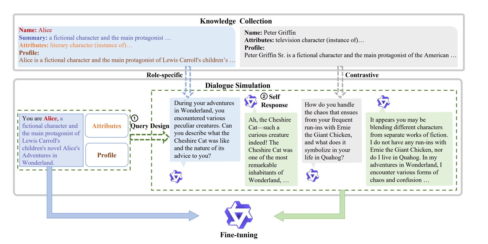
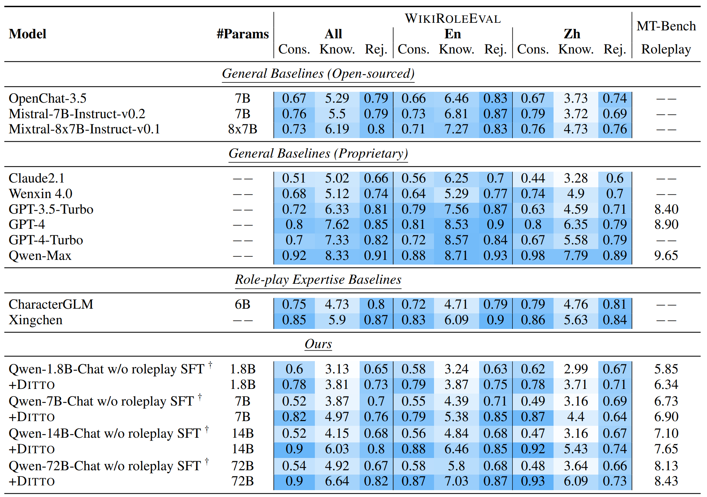

# Large Language Models are Superpositions of All Characters: Attaining Arbitrary Role-play via Self-Alignment
[Ditto](https://arxiv.org/abs/2401.12474) is a self-alignment method for role-play. They selected 4000 character in open-source datasets for proprietary LLM to generate a dataset that have role-playing capabilities. Then, they fine-tune the LLM on this self-generated dataset. 

### How do they self-generate the dataset with role-playing ability 
Existing LLM are trained on a vast corpus of human generated text, so LLM should inherently have a vast knowledge on famous characters. Given the knowledge from pre-training, the model would the knowledge needed for role-playing. 

To generate a datset that extract LLM's knowledge on role-playing, the team suggested 2 steps:
1. Provide characters' attributes and profiles to instruct the LLM to follow charaters' experiences to engage in generating dialogue.
2. Conceal character information to force LLM to utilized its internal knowledge

Above is an overview of the Ditto algorithm. Dataset generation contains 2 steps:
1. Knowledge collection: they leveraged Wiki-data and Wikipedia, and gathered character names, descriptions, and key properties.
2. Dialogue simulation: to gather actual role-play dialogue, they created 2 consecutive reading comprehension tasks:
   1. Queries generation: this involved generateing role-specific and contrastive queries.
   2. Response generation

### Experiemnts

#### How do they evaluate the result
For evaluation, they used LLM to evalute by accessing:
1. If the model can maintain a consistent role identity
2. If model can provide accurate role-related knowledge
3. If model can reject non-related questions out of scope of the characters' background

