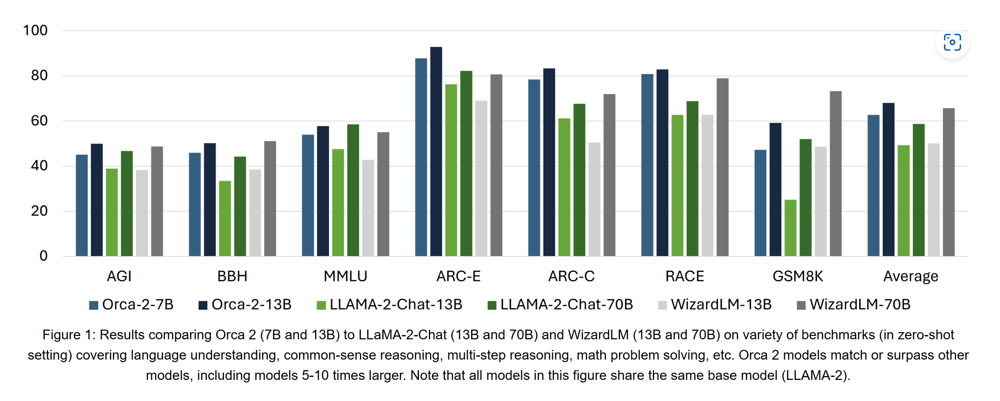

# Orca 2: Teaching Small Language Models How to Reason
In [Orca 2](https://www.microsoft.com/en-us/research/publication/orca-2-teaching-small-language-models-how-to-reason/), instead of using imitation learning to make small model to imitate large model behaviors, they focus on using large model reasoning ability to generate data that will be used to teach small model to reason.

### How to teach small model reason?
The authors suggested that there're 2 objectives to teach smaller language model to reason:
1. Teach smaller LM how to use different reasoning techniques, like step-by-step processing, recall-then-generate, etc.
2. Teach smaller LM when to use which techniques

### How to generate the data to teach small model?
To create the nuanced data to teach small model how to reason, they carefully crafted intricate prmopt(s) for strong LLMs to produce the data that demostrate such specific strategic behaviors.

In Orca2, they still leaverage **explanation tuning** to make sure LLMs generate data that follow closely the provided System instructions. System instructions will provide high-level guidelines for LLMs to adhere during generating response based on user-prompts.

### How they train the small model to reason?
To teach smaller model to be a cautious reasoner, the follow the steps during training:
1. Collect a diverse collection of tasks
2. Acquire performace scores for all reasoning techniques for each case. Then, decide which reasoning technique for which tasks. The performance score in Orca2 comes from Orca.
3. Write task specific System instructions for their chosen reasoning technique. This will make sure teacher (i.e LLM) generate response adhere to the chosen technique.
4. **Prompt Erasing**: During training, replace System instructions with a generatic details to approch the tash for the student (i.e smaller model). Prompt Erasing make sure the student doesn't have information on how to approach the task, so they need to learn the underlying strategy during training. 

### Experiemnts
Orca2 demostrates comparable reasoning abilities compared to other larger models.

